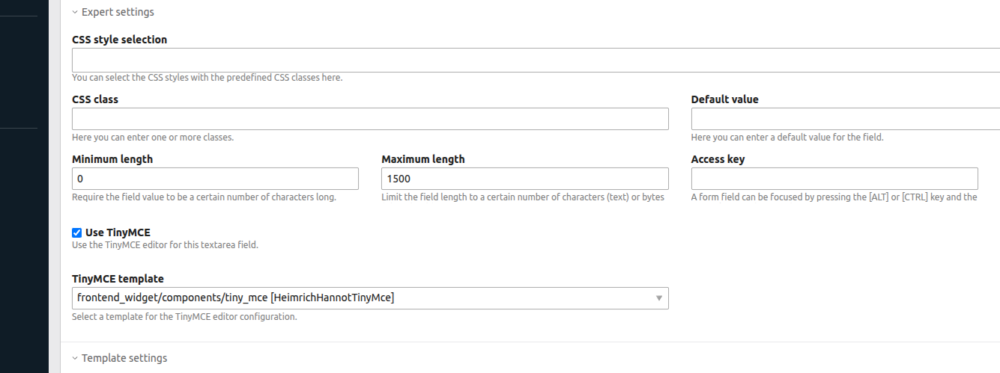

# Contao TinyMCE Bundle

This bundle allow using tinymce in the contao frontend (form generator).

## Installation

Install with composer or contao manager and update database afterwards.

```bash
composer require heimrichhannot/contao-tinymce-bundle
```

## Usage

You'll see a new checkbox in textarea fields within the expert legend. 



## Customization

You can create custom TinyMCE configurations by creating variant of `[contao/templates/frontend_widget/components/tiny_mce.html.twig](contao/templates/frontend_widget/components/tiny_mce.html.twig)`.